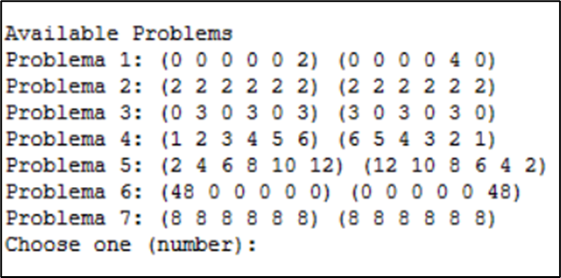
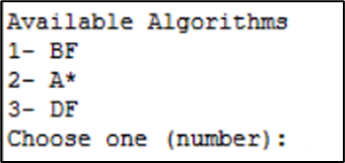
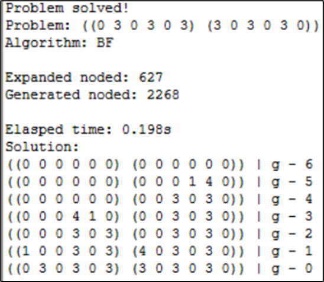

<header>

</header>

# 
Manual de Utilizador

### 
Inteligência Artificial - Escola Superior de Tecnologia de Setúbal

2024/2025

 

### 
Prof. Joaquim Filipe

### 
Eng. Filipe Mariano

 

### 
202000634 Bruno Ascenção

### 
202000584 Francisco Pereira

 

### 
Projeto Nº 1: Época Normal

20/12/2024

 

# Índice
<ol>
<li>Introdução</li>
<li>Instalação e utilização</li>
<li>Input/Output</li>
<ol>
<li>Input</li>
<ol>
<li>Ficheiros</li>
<li>Comandos</li>
</ol>
<li>Output</li>
</ol>
<li>Exemplo de aplicação</li>
</ol>

 

# 1. Introdução

Este documento tem como objetivo ser o Manual de Utilizador para a utilização do programa desenvolvido.

O programa é destinado à resolução, através de diferentes algoritmos, de diversos cenários possíveis do jogo “Adji-boto*”. Todos os algoritmos aplicados foram lecionados nas aulas de Inteligência Artificial.

Neste documento vai ser abordado como instalar e utilizar o programa, para que este fique pronto a ser usado pelo utilizador.

 

# 2. Instalação e utilização

Para utilizar o programa é necessário que o utilizador instale o IDE LispWorks. O IDE LispWorks é um software de desenvolvimento de Common Lisp.

Após a instalação do IDE, o utilizador deve abrir o ficheiro "project.lisp" que é o cérebro de todo o programa. Após aberto o ficheiro, o utilizador deverá carregar o mesmo. No listener, após o ficheiro carregado, o utilizador poderá iniciar o programa escrevendo o comando "(start)".

 

# 3. Input/Output

## 3.1. Input

### 3.1.1. Ficheiros
<list>
<li>Problemas.dat - Contém todos os problemas do programa.</li>
</list>

### 3.1.2. Comandos
<list>
<li>Menu problema - Utilizador deve escolher o problema a resolver;</li>
<li>Menu algoritmo - Utilizador deve escolher o algoritmo que será utilizado para resolver o problema</li>
<li>Heurística - O utilizador ao escolher o algoritmo "A*", aparece um menu para selecionar a heurística pretendida;</li>
<li>Profundidade máxima - O utilizador ao escolher o algoritmo "DF", aparece um menu para escolher a profunidade máxima que o algoritmo irá.</li>
</list>

## 3.2. Output
<list>
<li>Ficheiro estatísticas - Quando um problema termina de ser resolvido, é gerado um ficheiro na pasta "statistics". O nome do ficheiro é uma string da hora e data a que este foi gerado (hora, minuto, segundo, dia, mês, ano - xxxxxx_xxxxxx).</li>
</list>

 

# 4. Exemplo de aplicação

Ao fazer "(start)" ao programa, será apresentado um menu inicial que pede ao utilizador para indicar qual problema quer resolver. Este deve escolher o número correspondente ao problema.

</img>

Tendo já escolhido o problema, o utilizador passa ao menu seguinte que tem como objetivo escolher o algoritmo a utilizar na resolução do problema. Novamente, este deve escolher o respetivo número.

</img>

De seguida, o algoritmo começa a trabalhar na resolução do problema. Se terminar, exibe no terminal e cria um ficheiro com estatísticas relativas à resolução. Esses dados são o número de nós expandidos e gerados, o tempo que demorou a resolver e todos os passos até à solução.

</img>

Após terminar a resolução do problema, o utilizador pode repetir todo o processo utilizando diferentes problemas e algoritmos.
