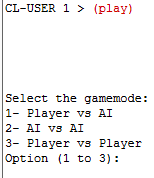
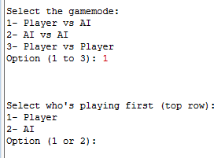
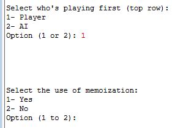
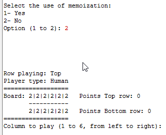
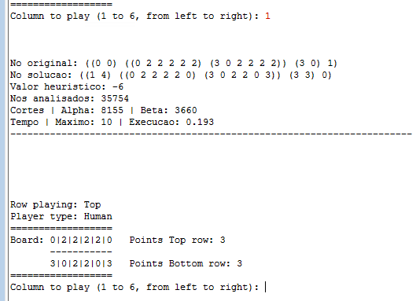

<header>

</header>

# 
Manual de Utilizador

### 
Inteligência Artificial - Escola Superior de Tecnologia de Setúbal

2024/2025

 

### 
Prof. Joaquim Filipe

### 
Eng. Filipe Mariano

 

### 
202000634 Bruno Ascenção

### 
202000584 Francisco Pereira

 

### 
Projeto Nº 2: Época Normal

24/01/2025

 

# Índice
<ol>
<li>Introdução</li>
<li>Utilização</li>
<li>Limitações</li>
<ol>
<li>Profundidade máxima</li>
</ol>
</ol>

 

# 1. Introdução

O programa consiste no jogo “Adji-boto*” onde é possível ao utilizador jogar contra outro utilizador, contra uma IA, ou colocar duas IAs a jogarem uma contra a outra.

 

# 2. Utilização

Ao compilar o programa, o primeiro comando a executar é o "(play)".

De seguida, o utilizador tem de escolher o modo de jogo utilizando um numéro entre 1 e 3, sendo as hipóteses "Player vs AI", "AI vs AI", "Player vs Player" respetivamente.

Ao selecionar a opção 1 "Player vs AI", o utilizador deve escolher quem começa a jogar, ele ou a IA. Pode escolher a opção através dos númeors 1 para o utilizador, ou 2 para a IA.

Já tendo escolhido quem começa a jogar, o utilizador deve decidir se quer utilizar a memoization escolhendo entre os números 1 para sim ou 2 para não.

Após a decisão sobre o uso do memoization, o jogo começa. Para cada jogada o utilizador deve indicar qual a coluna escolhida para a jogada, entre 1 e 6.

Após cada jogada do utilizador são exibidas as estatísticas da jogada da IA e repete o ciclo tendo o utilizador de inserir o número de 1 a 6.

Quando o modo de jogo é IA vs IA, o utilizador apenas tem de observar e esperar o fim do jogo. Se o modo de jogo for utilizador vs utilizador, ambos devem jogar na sua vez. Sempre que o jogo terminar, o utilizador deverá inserir novamente o comando "(play)" se quiser jogar novamente.

 

# 3. Limitações

## 3.1. Profundidade máxima

Não é permitido ao utilizador indicar a profundidade máxima que o algoritmo irá utilizar como limite de procura.
